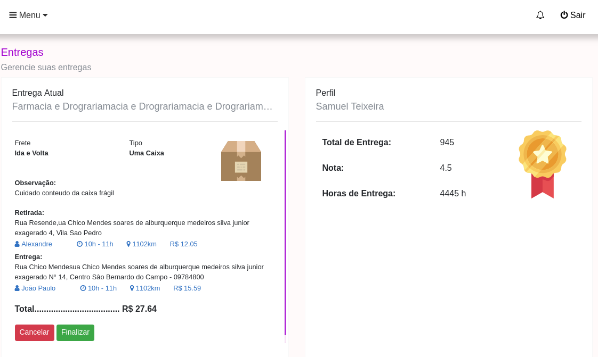

# Sistem of delivery 

This project was generated to improve the deliverys.

## Installation

1. Clone the repo: git remote add origin git@github.com:alexandrejuk/application_studies.git
2. cd application_studies
3. Install packages: npm install
4. Build project and launch: npm start
5. Open your browser at: http://localhost:4200

## Screenshot

## Author
[Alexandre dos Santos Soares](https://github.com/alexandrejuk)
